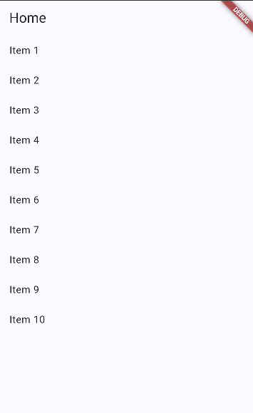
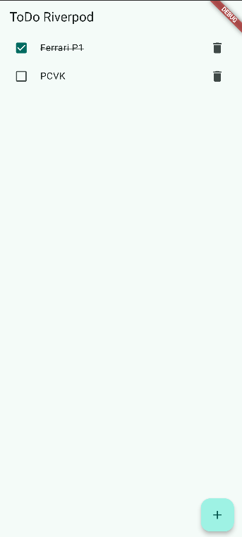
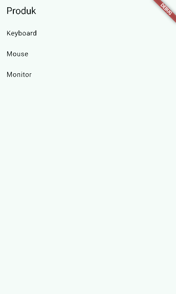
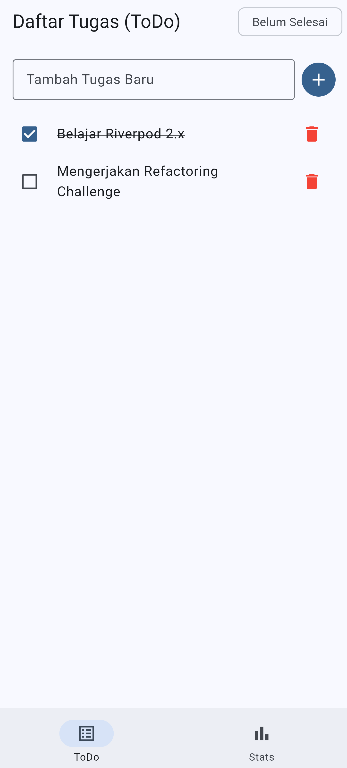

# Week 3: Navigation & State Management

**Nama:** M. Aldyth Rafiansyah Fauzi  
**NIM:** 244107020179  
**Kelas:** TI - 3G

## Tujuan pembelajaran

Setelah menyelesaikan codelab ini, mahasiswa mampu:

- menjelaskan konsep navigasi, route, dan perbedaan Navigator 1.0 dengan GoRouter;
- menerapkan navigasi multi-page dengan GoRouter, termasuk passing argument dan deep link sederhana;
- menjelaskan mengapa state management diperlukan dan cara kerja Riverpod (Provider, ConsumerWidget, Notifier);
- menggunakan AsyncValue untuk menangani state loading, error, dan success pada UI;
- membangun aplikasi ToDo dengan navigasi dan Riverpod, lalu memverifikasi hasilnya dengan widget test sederhana.

## Konsep Navigation & State Management

- **Navigasi:** Aplikasi menggunakan route untuk berpindah antarhalaman. GoRouter membuat deklarasi route lebih rapi dan mendukung parameter serta deep link.
- **State management:** Riverpod menyimpan dan mengubah data aplikasi tanpa harus meneruskan state secara manual antar-widget. `Provider`, `ConsumerWidget`, dan `Notifier` dipakai sesuai kebutuhan.
- **AsyncValue:** Data asynchronous memiliki tiga kondisi utama, yaitu loading, error, dan data. Dengan `AsyncValue`, UI dapat menangani ketiganya secara lebih teratur.

## Dokumentasi & Screenshots

### Praktikum

#### 1. Navigasi dengan GoRouter

> Praktikum ini membuat halaman home dan detail. Nilai `id` dikirim melalui path parameter pada route detail.

#### 2. Aplikasi ToDo dengan Riverpod

> Aplikasi ToDo menggunakan `ProviderScope`, `ConsumerWidget`, dan `Notifier`. Pengguna dapat menambah, mencentang, menghapus tugas, serta berpindah ke halaman statistik.

#### 3. Tampilan Awal AsyncValue

> Halaman produk dibuat menggunakan `AsyncNotifier` untuk mengambil data secara asynchronous.

#### 4. Eksperimen Loading dan Data

> Saat proses masih berjalan, aplikasi menampilkan indikator loading sebelum data produk muncul.

> Setelah proses selesai, data produk ditampilkan dalam bentuk daftar.

#### 5. Tampilan Error AsyncValue

> Kondisi error ditangani dengan pesan kesalahan dan tombol untuk mencoba memuat data lagi.

### Tugas Utama

#### 1. Halaman ToDo

> Halaman utama menampilkan daftar tugas yang dikelola oleh Riverpod. Pengguna dapat menambah, mencentang, dan menghapus tugas.

#### 2. Proses Loading pada Tugas

> `AsyncValue` menampilkan loading ketika data tugas sedang diproses.

#### 3. Halaman Statistik

> Halaman statistik dapat dibuka melalui navigasi bawah. Navigasi ini menggunakan `ShellRoute` dan `context.go`.

### Challenge

#### 1. Halaman Statistik dengan AsyncNotifier

> Challenge memakai `AsyncNotifier` untuk memuat beberapa data statistik. Data dapat berada dalam kondisi berhasil maupun gagal.

#### 2. Pengujian Challenge

> Pengujian digunakan untuk memastikan notifier dan halaman statistik berjalan sesuai kondisi yang diharapkan.

#### 3. Analisis Kode Challenge

> `flutter analyze` digunakan untuk memeriksa error dan masalah lint pada kode.

### Refactoring & Pengujian

#### 1. Hasil Refactoring

> Refactoring memisahkan model, provider, halaman, router, dan widget agar kode lebih mudah dibaca dan dikembangkan.

#### 2. Verifikasi Refactoring

> Hasil analisis menunjukkan kode setelah refactoring dapat diperiksa tanpa error yang mengganggu.

#### 3. Widget Test ToDo

> Widget test dipakai untuk memverifikasi tampilan dan interaksi dasar pada aplikasi ToDo.

## Refleksi

- **Kapan `setState` masih cukup, dan kapan state harus naik ke Riverpod?**
  `setState` masih cukup untuk state kecil yang hanya dipakai satu halaman. Riverpod lebih cocok jika state dipakai beberapa widget, perlu asynchronous process, atau harus tetap terpisah dari UI.

- **Apa perbedaan `context.go` dan `context.push`, dan kapan masing-masing tepat digunakan?**
  `context.go` berpindah ke route tujuan dan mengganti lokasi aktif. Ini cocok untuk tab seperti ToDo dan Stats. `context.push` menambahkan halaman baru ke stack, jadi cocok untuk membuka detail lalu kembali dengan tombol back.

- **Bagaimana `AsyncValue` mencegah bug dibanding tiga boolean terpisah?**
  `AsyncValue` menyatukan loading, error, dan data dalam satu state. Jadi kombinasi state yang tidak masuk akal, seperti loading dan error aktif bersamaan, lebih mudah dihindari.

- **Bagian mana dari hasil AI yang Anda perbaiki, dan mengapa?**
  Saya memperbaiki struktur route, pemisahan provider, dan tampilan error agar sesuai dengan alur aplikasi. Saya juga mengecek kembali hasil AI melalui `flutter analyze`, `flutter test`, serta mencoba navigasi dan proses loading secara langsung.
