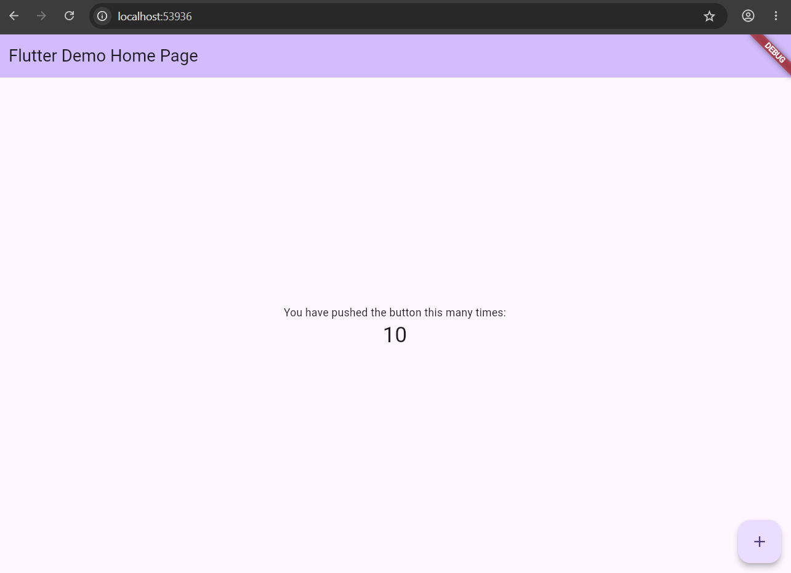
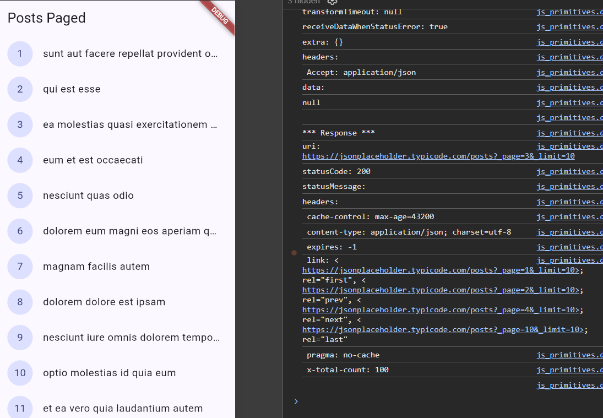
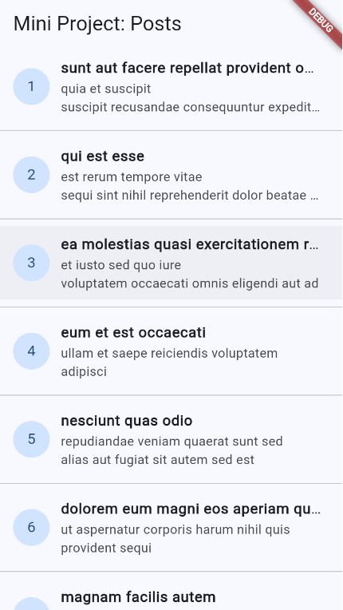

 # Week 4 - Networking REST API

 ## Identitas

 - **Nama:** M. Aldyth Rafiansyah Fauzi
 - **NIM:** 244107020179
 - **Kelas:** TI - 3G

 ## Tujuan Pembelajaran

 Setelah menyelesaikan codelab ini, mahasiswa mampu:

 - menjelaskan konsep HTTP, REST API, dan JSON;
 - memetakan JSON ke model Dart dengan serialization yang aman terhadap nilai `null`;
 - menerapkan repository pattern agar UI tidak memanggil API secara langsung;
 - mengonfigurasi Dio dengan base URL, timeout, dan interceptor;
 - menangani error jaringan dan menampilkan state loading, error, empty, serta success menggunakan `AsyncValue` dan Riverpod;
 - menerapkan pagination dasar dengan infinite scroll.

 ## Konsep Singkat

 ### HTTP, REST API, dan JSON

 HTTP digunakan untuk mengirim request dari aplikasi ke server. Pada tugas ini, aplikasi memakai method `GET` untuk mengambil data post dari [JSONPlaceholder](https://jsonplaceholder.typicode.com/).

 Data dari server berbentuk JSON. Data tersebut kemudian diubah menjadi object Dart `Post` yang memiliki `id`, `userId`, `title`, dan `body`.

 ### Serialization null-safe

 `Post.fromJson()` dipakai untuk mengubah JSON menjadi object `Post`. Jika ada field yang kosong, aplikasi memakai nilai default seperti `0` atau string kosong. Cara ini mencegah error ketika data dari server tidak lengkap. `toJson()` digunakan untuk mengubah object kembali ke bentuk JSON.

 ### Repository pattern

 Pada project ini, UI tidak memanggil Dio secara langsung. UI meminta data melalui provider, kemudian provider menggunakan `PostRepository`. Repository yang mengambil data melalui `ApiClient` dan mengubahnya menjadi model `Post`.

 ### Dio dan penanganan error

 Pengaturan Dio diletakkan di `ApiClient`, yaitu:

 - base URL `https://jsonplaceholder.typicode.com`;
 - connect timeout 5 detik;
 - receive timeout 3 detik;
 - interceptor untuk mencatat request, response, dan error saat debug.

 Error dari Dio diubah menjadi pesan yang lebih sederhana, seperti koneksi timeout, tidak ada internet, atau data tidak ditemukan.

 ### AsyncValue dan pagination

 Dengan `AsyncValue`, halaman dapat menampilkan loading, error, data berhasil, atau pesan ketika data kosong.

 Untuk pagination, aplikasi mengambil 10 post terlebih dahulu. Saat scroll hampir sampai bawah, aplikasi meminta data berikutnya menggunakan `_start` dan `_limit`.

 ## Implementasi

 Alur data aplikasi adalah:

 ```text
 PagedPostPage
	 ↓
 postListProvider (AsyncNotifier)
	 ↓
 PostRepository
	 ↓
 ApiClient (Dio)
	 ↓
 JSONPlaceholder REST API
 ```

 Aplikasi juga menggunakan GoRouter untuk berpindah dari halaman daftar post ke halaman detail melalui route `/detail/:id`.

 ## Dokumentasi Hasil

 ### Praktikum 1

 

 > Praktikum 1 berisi implementasi awal pengambilan dan penampilan data dari REST API.

 ### Praktikum 2

 #### Skenario 1

 

 #### Skenario 2

 

 #### Skenario 3

 

 > Praktikum 2 menunjukkan beberapa skenario penggunaan dan penanganan state pada aplikasi.

 ### Praktikum 3

 

 > Praktikum 3 melanjutkan penggunaan provider untuk mengelola data dari API.

 ### Refactoring

 

 > Struktur kode dirapikan dengan memisahkan API client, repository, provider, dan halaman UI.

 

 > Hasil analisis dan test digunakan untuk memastikan proses refactoring tidak menimbulkan error.

 ### AI Challenge

 

 > AI Challenge digunakan untuk membantu pengembangan, analisis, dan pengujian fitur networking.

 ### Tugas

 

 > Halaman utama menampilkan daftar post dari REST API. Setiap item berisi nomor, judul, dan ringkasan isi post.

 

 > Menekan salah satu item membuka halaman detail melalui GoRouter dan menampilkan judul, user ID, serta isi post secara lengkap.

 

 > Validasi tugas dilakukan menggunakan `flutter analyze` dan pengujian Flutter.

 ## Pengujian

 Pengujian yang dibuat mencakup:

 - `Post.fromJson()` tetap aman ketika field JSON tidak lengkap atau bernilai `null`;
 - provider daftar post dapat mengembalikan data dari fake repository;
 - kondisi `hasReachedMax` bernilai benar ketika jumlah data yang diterima lebih kecil dari limit.

 Repository dapat diganti dengan `FakePostRepository` melalui provider override. Dengan cara ini, provider dapat diuji tanpa bergantung pada koneksi internet atau server asli.

 ## Refleksi

 ### 1. Mengapa UI dilarang memanggil Dio langsung?

 UI sebaiknya hanya mengatur tampilan. Kalau UI memanggil Dio langsung, kode API dan tampilan akan tercampur sehingga sulit dirawat dan diuji. Repository membuat pengambilan data lebih rapi karena semua akses API berada di satu tempat.

 ### 2. Kapan pagination client-side cukup?

 Pagination client-side cukup untuk data yang sedikit dan sudah ada di aplikasi. Kalau datanya banyak atau terus bertambah, lebih baik memakai pagination server seperti `_page` dan `_limit` agar aplikasi hanya mengambil data yang diperlukan.

 ### 3. Bagaimana exception repository berubah menjadi `AsyncError`?

 Riverpod otomatis mengubah exception dari repository menjadi `AsyncError`. Jadi, widget cukup menangani state `loading`, `error`, dan `data` tanpa menulis `try/catch` di setiap halaman. `try/catch` tetap diperlukan jika error ingin ditangani khusus, misalnya saat mengambil data berikutnya ketika infinite scroll.

 ### 4. Bagian hasil AI yang diperbaiki

 Saya memperbaiki pemisahan antara API client, repository, provider, dan UI. Saya juga menambahkan nilai default pada JSON, pesan error, state empty, tombol retry, refresh, detail post, dan pagination supaya aplikasi lebih aman saat data atau koneksi bermasalah.

