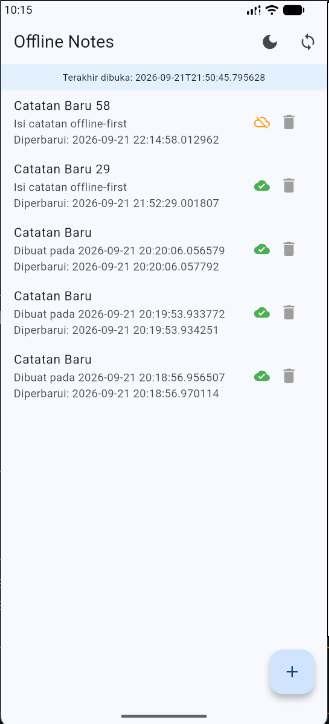
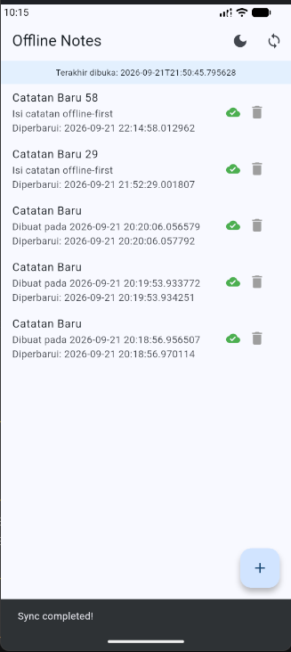
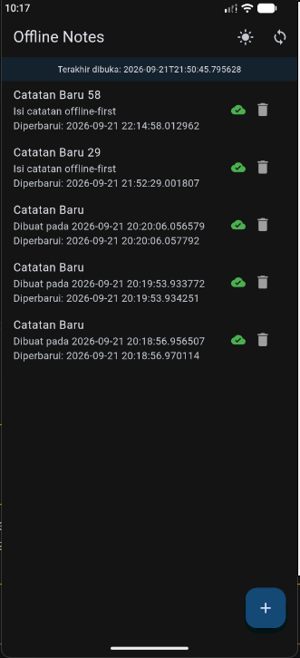
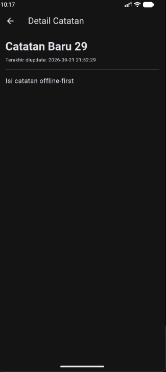
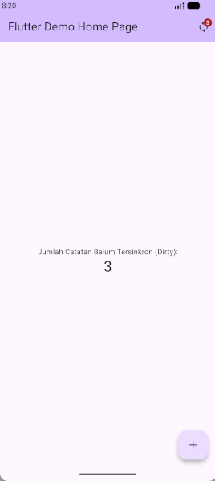
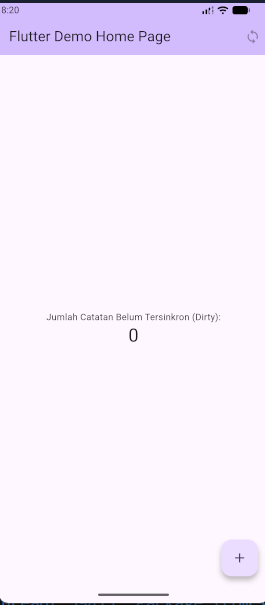

# Week 5 - Local Storage dan Offline-First

## Identitas

- **Nama:** M. Aldyth Rafiansyah Fauzi
- **NIM:** 244107020179
- **Kelas:** TI - 3G

## Tujuan Pembelajaran

Setelah menyelesaikan codelab ini, mahasiswa mampu:

- menjelaskan perbedaan penyimpanan key-value, relasional, dan NoSQL di perangkat;
- menyimpan preferensi sederhana seperti tema dan waktu terakhir aplikasi dibuka dengan SharedPreferences;
- menerapkan CRUD catatan menggunakan SQLite melalui repository lokal;
- menerapkan pola offline-first dengan cache-first read, `dirty flag`, dan sinkronisasi;
- menampilkan state loading, error, empty, dan success menggunakan Riverpod;
- menguji repository lokal menggunakan repository palsu tanpa database sungguhan.

## Konsep Singkat

Pada aplikasi ini, setiap jenis penyimpanan dipakai sesuai kebutuhannya:

- **SharedPreferences:** untuk data kecil seperti tema dan waktu terakhir dibuka.
- **SQLite:** untuk menyimpan catatan karena mendukung tabel dan operasi CRUD.
- **Riverpod:** untuk mengatur state loading, success, error, dan empty.
- **Offline-first:** data dibaca dari lokal lebih dulu. Catatan baru diberi `dirty = 1`, lalu ditandai sudah sync setelah proses sinkronisasi selesai.

## Struktur Implementasi

```text
lib/
├── data/
│   ├── local/
│   │   ├── db.dart
│   │   └── note.dart
│   ├── prefs.dart
│   ├── sync.dart
│   └── repositories/
│       └── note_repository.dart
├── pages/
│   ├── note_detail_page.dart
│   ├── notes_page.dart
│   └── settings_page.dart
├── providers/
│   └── theme_provider.dart
└── widgets/
	└── note_tile.dart
```

## Dokumentasi Screenshot

### Tampilan dan fitur catatan



> Tampilan utama aplikasi Offline Notes untuk melihat daftar catatan lokal.



> Catatan baru dapat dibuat dari tombol tambah dan langsung disimpan secara lokal.



> Halaman detail menampilkan isi catatan yang dipilih.



> Tema aplikasi dapat diubah dan preferensinya disimpan menggunakan SharedPreferences.

### Simulasi sinkronisasi



> Kondisi sebelum sync: catatan lokal masih memiliki perubahan yang ditandai sebagai dirty.



> Kondisi setelah sync: proses selesai dan status perubahan lokal telah diproses.

## Refleksi

### 1. Mengapa daftar catatan tidak boleh disimpan di SharedPreferences?

Karena SharedPreferences hanya cocok untuk data sederhana berupa key-value. Kalau daftar catatan disimpan di sana, semua data harus diubah menjadi JSON dan akan sulit saat mencari, mengubah, atau menghapus satu catatan. SQLite lebih cocok untuk kebutuhan CRUD.

### 2. Kapan cache-first cukup?

Cache-first cukup untuk data yang tidak harus selalu terbaru, seperti catatan. Untuk data seperti harga, stok, atau status pembayaran, lebih baik menggunakan network-first agar data yang ditampilkan tetap terbaru.

### 3. Bagaimana dirty flag menjadi antrean sync tanpa memblokir UI?

Saat ada perubahan, data langsung disimpan ke lokal dan diberi `dirty = 1`. UI tidak perlu menunggu proses server. Saat sync berjalan, catatan dirty diproses lalu diubah menjadi `dirty = 0`. Tabel outbox diperlukan jika setiap operasi create, update, dan delete harus dicatat serta bisa diulang ketika gagal.

### 4. Bagian rekomendasi AI yang ditolak

Saya menolak rekomendasi untuk menyimpan semua catatan sebagai JSON di SharedPreferences. Memang lebih cepat dibuat, tetapi akan menyulitkan proses CRUD. Saya memilih SQLite karena lebih rapi dan sesuai untuk data catatan.
