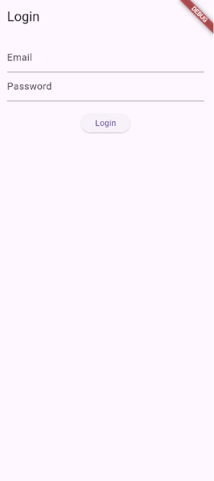
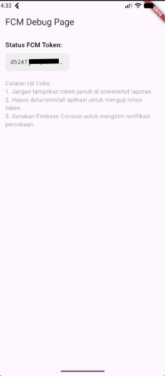
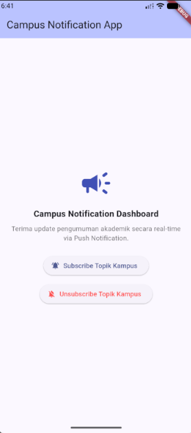
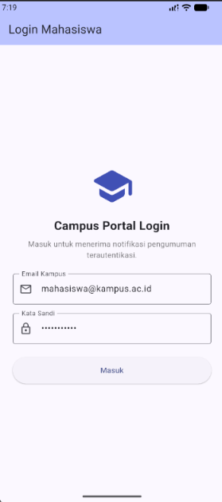
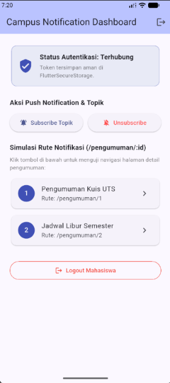

# Week 6 - Authentication, Security & FCM

**Nama:** M. Aldyth Rafiansyah Fauzi \
**NIM:** 244107020179 \
**Kelas:** TI - 3G

## Tujuan Pembelajaran

Setelah menyelesaikan codelab ini, saya dapat:

- menjelaskan alur Firebase Auth, JWT, OAuth, dan Google Login serta perbedaan ID token, access token, dan refresh token;
- menyimpan token menggunakan secure storage dan memahami proses refresh token otomatis;
- menjelaskan hubungan app server, Firebase Cloud Messaging (FCM), dan perangkat;
- meminta permission notifikasi dan mengelola lifecycle token melalui `getToken` serta `onTokenRefresh`;
- membedakan notification payload dan data payload pada kondisi foreground, background, dan terminated;
- menangani klik notifikasi menggunakan deep link GoRouter serta menggunakan topic messaging;
- menerapkan keamanan dasar, seperti tidak menyimpan secret di source code dan tidak mencetak token ke log.

## Konsep Singkat

Autentikasi menggunakan token untuk menjaga session pengguna. Access token dipakai untuk mengakses API, refresh token untuk meminta token baru, sedangkan ID token berisi identitas pengguna. Token harus disimpan di secure storage.

FCM menghubungkan app server, Firebase, dan perangkat. Token perangkat dipakai untuk mengirim notifikasi, sedangkan topic digunakan untuk pesan kepada banyak pengguna.

## Implementasi Aplikasi

1. **Route guard:** GoRouter mengarahkan pengguna yang belum memiliki access token ke `/login`.
2. **Secure storage:** access token, refresh token, dan FCM device token disimpan melalui `FlutterSecureStorage`, bukan `SharedPreferences`.
3. **Token refresh:** interceptor Dio mendeteksi respons `401`, mencoba memakai refresh token, lalu mengulang request satu kali. Jika refresh gagal, session dibersihkan dan pengguna perlu login lagi.
4. **Permission:** aplikasi meminta izin notifikasi Android 13+ melalui `POST_NOTIFICATIONS` dan izin APNs pada iOS.
5. **Token lifecycle:** `getToken` mengambil token awal, sedangkan `onTokenRefresh` mengirim token baru ke backend melalui `POST /devices`.
6. **Topic messaging:** pengguna dapat subscribe atau unsubscribe dari topic `pengumuman-kampus`.
7. **Deep link:** nilai `data['route']` dipakai untuk membuka rute seperti `/pengumuman/3` melalui GoRouter.
8. **Foreground notification:** ketika aplikasi aktif, pesan ditampilkan sebagai heads-up banner menggunakan `flutter_local_notifications`.

## Perilaku pada Tiga State Aplikasi

| State      | Perilaku                                                                                    | Handler yang digunakan        |
| ---------- | ------------------------------------------------------------------------------------------- | ----------------------------- |
| Foreground | `onMessage` menerima pesan dan aplikasi menampilkan local notification.                     | `FirebaseMessaging.onMessage` |
| Background | Sistem menampilkan notifikasi. Saat notifikasi diklik, aplikasi membuka route dari payload. | `onMessageOpenedApp`          |
| Terminated | Aplikasi dibuka dari keadaan mati dan membaca pesan awal untuk melakukan deep link.         | `getInitialMessage`           |

## Dokumentasi Screenshot

### Praktikum 1

> Dokumentasi setup dan token FCM.

### Praktikum 2

> Pengujian pengiriman notifikasi dari Firebase Console.

> Hasil notifikasi yang diterima aplikasi.

### Praktikum 3

> Pengujian notifikasi saat aplikasi berada di foreground.

> Pengujian notifikasi saat aplikasi berada di background dan setelah diklik.

> Pengujian notifikasi saat aplikasi berada di terminated dan setelah diklik.

### AI Challenge

> Dokumentasi hasil AI Challenge.

### Tugas

> Dokumentasi tugas autentikasi dan keamanan.

## Refleksi

1. **Refresh token dan SharedPreferences:** SharedPreferences tidak dirancang untuk menyimpan data rahasia. Jika refresh token bocor, orang lain dapat mengambil alih session, sehingga token disimpan di secure storage.

2. **Jika `onTokenRefresh` diabaikan:** backend menyimpan token lama dan notifikasi baru bisa tidak sampai ke perangkat setelah token berubah.

3. **Topic dan token perangkat:** topic digunakan untuk broadcast, misalnya pengumuman jadwal UTS. Token perangkat digunakan untuk pesan personal, misalnya status pengajuan surat mahasiswa.

4. **Perbaikan draf AI:** Saya menolak bagian yang menyamakan ID token, access token, dan refresh token karena fungsi serta risikonya berbeda. Saya juga memperbaiki penjelasan FCM dengan menambahkan lifecycle `onTokenRefresh` dan membedakan penggunaan topic untuk broadcast dengan token perangkat untuk notifikasi personal.
