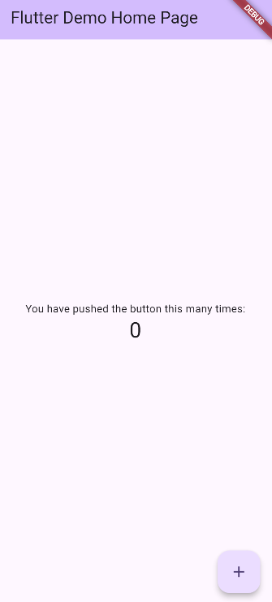
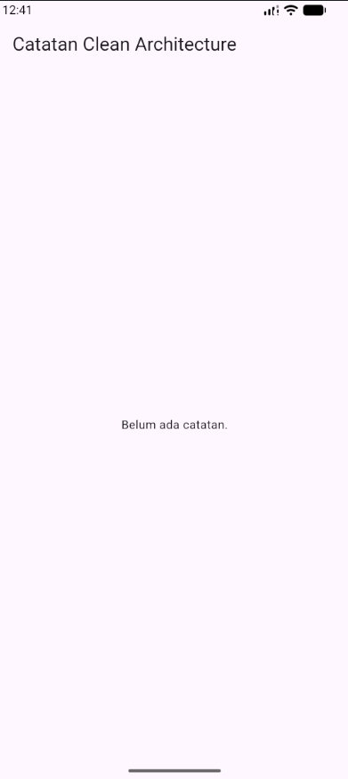

# Week 7 - Clean Architecture

**Nama:** M. Aldyth Rafiansyah Fauzi \
**NIM:** 244107020179 \
**Kelas:** TI - 3G

## Tujuan Pembelajaran

Setelah menyelesaikan codelab ini, saya dapat:

- menjelaskan prinsip SOLID dan separation of concerns dengan contoh kode Flutter;
- membedakan struktur feature-first dan layer-first beserta trade-off-nya;
- menjelaskan tiga layer, yaitu presentation, domain, dan data, serta aturan dependensi yang mengarah ke dalam;
- membedakan entity dan model serta memahami peran repository, use case, dan dependency injection;
- merefactor project Minggu 5/6 menjadi struktur feature-first yang terpisah layer-nya;
- menguji use case dengan repository palsu tanpa database atau jaringan sungguhan.

## Konsep Singkat

Clean Architecture memisahkan kode berdasarkan tanggung jawabnya. Layer presentation menangani tampilan dan state, layer domain berisi aturan bisnis serta kontrak repository, sedangkan layer data menangani sumber data dan implementasi repository.

Dependensi diarahkan ke dalam. Dengan begitu, domain tidak bergantung pada Flutter, database, atau jaringan. Dependency injection digunakan agar presentation tidak membuat repository secara manual dan agar implementasi dapat diganti dengan mudah saat pengujian.

Struktur feature-first mengelompokkan kode berdasarkan fitur, lalu memisahkan setiap fitur ke dalam layer presentation, domain, dan data. Struktur ini membuat kode lebih mudah ditemukan dan dikembangkan ketika jumlah fitur bertambah.

## Praktikum 1: Audit Layer Project Lama

### Tabel Pemetaan File dan Hasil Temuan Audit

| File                               | Layer Saat Ini       | Masalah / Temuan Audit                                                                                 | Target Refactor                                                                        |
| :--------------------------------- | :------------------- | :----------------------------------------------------------------------------------------------------- | :------------------------------------------------------------------------------------- |
| `lib/pages/notes_page.dart`        | presentation         | Instansiasi manual `PrefsRepository()` langsung di dalam widget UI sehingga dependency injection bocor | Inject melalui Riverpod di layer presentation                                          |
| `lib/pages/settings_page.dart`     | presentation         | Deklarasi provider `PrefsRepository` ditulis di file UI                                                | Pindahkan provider ke folder `presentation/providers`                                  |
| `lib/providers/auth_provider.dart` | presentation (state) | Instansiasi manual `AuthRepository()` tanpa abstraksi interface                                        | Gunakan interface `AuthRepository` dari layer domain                                   |
| `lib/data/auth_repository.dart`    | data                 | Kontrak (interface) dan implementasi masih menyatu dalam satu kelas                                    | Pisahkan ke `domain/.../auth_repository.dart` dan `data/.../auth_repository_impl.dart` |

### Ringkasan Pelanggaran Klasik

Hasil pemeriksaan dengan Grep/Select-String:

- **Widget menyentuh jaringan/database:** 0 violations
- **Logika bisnis di dalam `build()`:** 0 violations
- **Instansiasi manual (DI bocor):** 3 violations, yaitu pada `notes_page.dart`, `settings_page.dart`, dan `auth_provider.dart`

## Hasil Refactor

Perbaikan difokuskan pada pemisahan tanggung jawab dan pengurangan dependency injection yang bocor. Provider dipindahkan dari file UI ke lokasi khusus presentation, sedangkan kontrak repository dipindahkan ke domain. Implementasi repository tetap berada di data dan digunakan melalui interface domain.

Dengan struktur ini, widget hanya berinteraksi dengan provider atau state yang dibutuhkan. Kode domain dapat diuji menggunakan repository palsu tanpa harus menjalankan database maupun jaringan sungguhan.

## Dokumentasi Screenshot

### Audit Project Sebelum Refactor

> Kondisi struktur dan dependency project sebelum dilakukan refactor.

### Struktur Project Setelah Refactor

> Kondisi project setelah provider dan repository dipisahkan sesuai layer Clean Architecture.

## Refleksi

1. **Mengapa interface repository harus tinggal di domain, bukan di data?**  
   Domain berisi aturan bisnis dan kontrak yang dibutuhkan aplikasi. Jika interface diletakkan di data, domain akan bergantung pada detail sumber data. Akibatnya, penggantian database atau API menjadi lebih sulit dan prinsip dependency inversion tidak tercapai.

2. **Kapan use case benar-benar dibutuhkan?**  
   Use case dibutuhkan ketika terdapat aturan bisnis, kombinasi beberapa repository, atau alur yang perlu digunakan kembali. Untuk operasi sederhana, repository langsung ke notifier masih cukup agar struktur project tidak terlalu kompleks.

3. **Apa biaya over-engineering bagi tim kecil?**  
   Use case untuk setiap operasi CRUD satu baris dapat menambah jumlah file, boilerplate, dan waktu pemeliharaan. Biayanya sepadan jika aplikasi akan berkembang, memiliki aturan bisnis yang kompleks, atau membutuhkan pengujian dan perubahan sumber data secara rutin.

4. **Bagian mana dari usulan AI yang saya tolak atau sederhanakan?**  
   Saya menyederhanakan pemisahan layer pada bagian yang belum memiliki aturan bisnis kompleks. Tidak semua operasi harus langsung dibuatkan use case terpisah. Refactor diprioritaskan pada masalah nyata, yaitu dependency injection yang bocor dan bercampurnya kontrak dengan implementasi repository.
